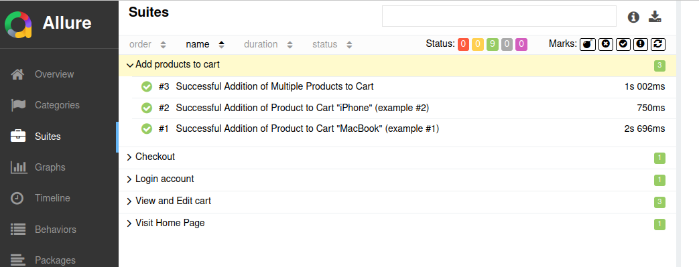

About this repository
==================
This repository contains the final exercise for the course QA & Testing from Hiberus University.

🌳 Cypress
---

This project uses [Cypress](https://www.cypress.io/) for end-to-end testing. We are working with [Open Cart](http://opencart.abstracta.us/)

## Getting Started

To get started with this project, clone the repository and install the dependencies:

```sh
git clone https://github.com/yourusername/your-repo.git
cd your-repo
npm install
npx cypress open
```

✅ How I run the tests?
---

All tests: 
```sh
npx cypress run
```

Smoke: 
```sh
npm run e2e:smoke
```

Regression: 
```sh
npm run e2e:regression
```


📄 Reporting
---


If we want a Mochawesome report, when we  throw the command 

```sh
npx cypress run
```


We see in our console: 


and we'll get this report:


If we want an Allure report, we can throw the command 

```sh
npx allure serve allure-results/
```

and we'll get this report:

